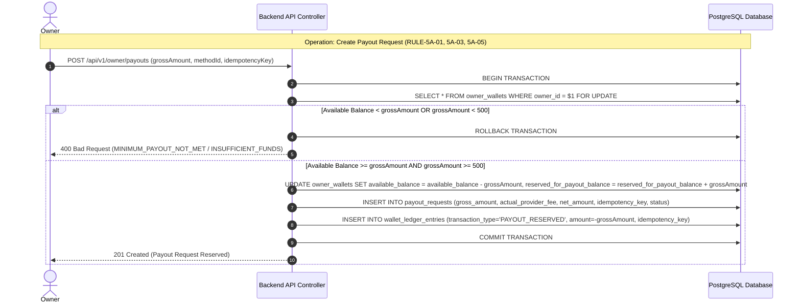
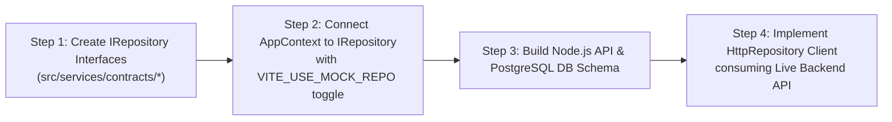

# 🏛️ PHASE 7 MASTER SPECIFICATION & ARCHITECTURE BLUEPRINT
## Production Backend Infrastructure, Database Architecture & Contract Specification
### Sola | Vacation Rentals — Sola Owner App

---

> [!IMPORTANT]
> **OFFICIAL PHASE 7 SOURCE OF TRUTH & ARCHITECTURE DESIGN GATE**
> - **Specification File**: [`PHASE_7_MASTER_SPECIFICATION.md`](file:///c:/Users/Essam/OneDrive/Desktop/YALLAH%20MASYAF/PHASE_7_MASTER_SPECIFICATION.md)
> - **Source Code Safety Boundary**: **0 source files modified in `src/` / 0 implementation code written**.
> - **Phase 6 Baseline**: **FROZEN & IMMUTABLE (100% Closed & Source of Truth)**.
> - **Canonical Scope Definition (F-06)**:
>   - **IN SCOPE**: Production Backend Infrastructure + PostgreSQL Database Architecture + IRepository Contracts + HttpRepository Integration Client.
>   - **EXPLICITLY OUT OF SCOPE**: New UI Screens, Admin Web Portal UI, Renter App UI, External Payment Gateway Integration, Real SMS Provider Integration, Cloud Media Storage Implementation.

---

## 1. 🎯 PHASE OBJECTIVE & SCOPE

The primary objective of Phase 7 is to establish the **Production Backend Infrastructure, PostgreSQL Database Architecture, IRepository Contracts, and HttpRepository Integration Client** for Sola Vacation Rentals.

### Key Transformation Goals:
1. **Server-Authoritative Authority**: Transfer all financial calculations, status transitions, and validation guards from client memory to server controllers and database ACID transactions.
2. **Repository Decoupling & HttpRepository Integration**: Introduce clean `IRepository` contract interfaces in `src/services/contracts/*` and implement `HttpRepository` client. Setting `VITE_USE_MOCK_REPO=false` connects the Owner App to live REST APIs, while `VITE_USE_MOCK_REPO=true` maintains local demo mode.
3. **Single-Account Running Balance Transaction Ledger (F-03)**: Guarantee zero money creation or loss, strict running balance ledger tracking, idempotency enforcement (`idempotency_key UNIQUE`), and pessimistic row locking (`FOR UPDATE`) across all wallet operations.
4. **Security & Role Boundary Isolation**: Completely isolate Admin governance endpoints (`/api/v1/admin/*`) from Owner application access via strict JWT Role-Based Access Control (RBAC).

---

## 2. 🏛️ CURRENT ARCHITECTURE BASELINE

```
[ UI Components Layer (React 19 / TailwindCSS / Lucide) ]
                      │
                      ▼
[ AppContext & AuthContext Application Hooks ]
                      │
                      ▼ (Direct Static Singleton Import)
[ mockRepository (In-Memory Arrays in mockRepository.ts) ]
                      │
                      ▼
[ mockData.ts / localStorage (Auth Flags & Listing Drafts Only) ]
```

---

## 3. 🎯 TARGET PRODUCTION ARCHITECTURE

```
[ Owner Mobile Application UI (100% Reusable) ]
                      │
                      ▼
[ AppContext & Custom Application Hooks ]
                      │
                      ▼ (Abstract Interface Boundary in src/services/contracts/*)
[ IRepository Contract Interfaces (IPropertyRepo, IBookingRepo, IWalletRepo, etc.) ]
         ┌────────────┴────────────┐
         │ (VITE_USE_MOCK_REPO=true)│ (VITE_USE_MOCK_REPO=false)
         ▼                         ▼
[ mockRepository ]       [ HttpRepository Client (src/services/http/*) ]
                                   │ (Bearer Token Interceptor)
                                   ▼
                         [ Node.js Production API Gateway ]
                                   │ (JWT Auth & Role Guards)
                                   ▼
                         [ Server Domain Services & Financial Engine ]
                                   │ (ACID Transactions & Row Locking)
                                   ▼
                         [ PostgreSQL Relational Database ]
```

### Strict Authority Rules:
- **Client = NEVER Authoritative**: The client cannot calculate deposits, commission, remaining balances, wallet totals, or enforce state transitions.
- **Server = 100% Authoritative**: The server receives intent DTOs, validates JWT claims, executes ACID database transactions, applies 21 financial rules, and writes immutable audit logs.

---

## 4. 📦 COMPREHENSIVE DOMAIN INVENTORY

The following inventory details the 14 project domains extracted from [`src/types/index.ts`](file:///c:/Users/Essam/OneDrive/Desktop/YALLAH%20MASYAF/src/types/index.ts) and [`src/services/mockRepository.ts`](file:///c:/Users/Essam/OneDrive/Desktop/YALLAH%20MASYAF/src/services/mockRepository.ts):

| # | Domain Name | Current Implementation | Source of Truth | Persistent DB Entities | Server Responsibilities | Client Responsibilities |
| :-: | :--- | :--- | :--- | :--- | :--- | :--- |
| **1** | **Auth** | `AuthContext` + `localStorage` | DB `user_sessions` | `owners`, `user_sessions` | Phone OTP generation, SMS dispatch, JWT issuing, session revocation | Phone input, OTP entry UI, token storage |
| **2** | **Owners** | `MOCK_OWNER` in memory | DB `owners` table | `owners` | Profile metadata persistence, verification status tracking | Profile UI rendering, document selection |
| **3** | **Properties** | `currentProperties` array | DB `properties` table | `properties`, `property_verification_documents` | State machine transitions (`DRAFT` ➔ `PENDING_REVIEW` ➔ `PUBLISHED`), title/pricing validations | 4-step listing wizard UI, status filter tabs |
| **4** | **Calendar** | `currentAvailability` array | DB `property_availability` | `property_availability` | Date exclusion overlap checks, per-night dynamic price overrides | Month grid UI, date block/unblock toggles |
| **5** | **Bookings** | `currentBookings` array | DB `bookings` table | `bookings`, `booking_snapshots`, `booking_financial_summaries` | 24h cron expiration worker, snapshot immutability freezing, modification/cancellation evaluation | Booking cards UI, filter tabs (Pending, Upcoming, Past) |
| **6** | **Financials** | `getOrCreateFinancialSummary` | DB `booking_financial_summaries` | `booking_financial_summaries` | Computing deposit 20% Sola commission, 0% remaining balance commission, Cash-on-Arrival separation | Rendering financial breakdown cards |
| **7** | **Wallet** | `currentOwnerWallet` object | DB `owner_wallets` table | `owner_wallets`, `wallet_ledger_entries` | ACID wallet balance mutations (`FOR UPDATE`), running balance ledger tracking, idempotency checks | Displaying balances (`Available`, `Pending`, `Held`, `Reserved`) |
| **8** | **Payouts** | `currentPayoutRequests` array | DB `payout_requests` table | `payout_requests`, `owner_payout_methods` | Enforcing 500 EGP min limit, provider fee deduction ($net = gross - fee$), reservation hold locking | Payout form, payout method selection, payout history |
| **9** | **Disputes** | `currentDisputes` array | DB `disputes` table | `disputes`, `financial_dispute_holds`, `dispute_evidence` | Freezing deposit in `heldBalance`, 24h/48h timeout cron worker, refund calculations | Dispute details view, owner evidence text/photo upload |
| **10**| **Verification**| `OwnerVerificationDocument` | DB `property_verification_documents` | `property_verification_documents` | Reviewing document taxonomy (`NATIONAL_ID`, `PROPERTY_DEED`), setting verification status | Document type picker, file upload trigger |
| **11**| **Messaging** | `currentChatMessages` map | DB `chat_messages` table | `chat_conversations`, `chat_messages` | Message storage, timestamping, unread status tracking | Chat thread UI, message input |
| **12**| **Notifications**| `currentNotifications` array| DB `notifications` table | `notifications` | System alert generation, unread counters, routing payload generation | Drawer UI, mark-as-read triggers |
| **13**| **Analytics** | `getAdvancedAnalytics` engine| DB Aggregation Queries | None (Derived Views) | Dynamic SQL aggregation of Occupancy %, ADR, RevPAR, ALOS, Lead Time, Approval Rate | Metric cards, multi-property ranking table, CSV/PDF trigger |
| **14**| **Admin** | Embedded mock functions | DB `admin_users`, `audit_logs` | `admin_users`, `audit_logs` | Platform governance, property approval, payout approval, dispute resolution | None in Owner App (Isolated Admin Web App) |

---

## 5. 🗄️ POSTGRESQL PRODUCTION DATABASE SCHEMA (F-02 & F-04 FIXES APPLIED)

```sql
-- PostgreSQL Production Schema for Sola Vacation Rentals
-- Complies with all 21 Approved Business Rules & 5 State Machines

CREATE EXTENSION IF NOT EXISTS "uuid-ossp";
CREATE EXTENSION IF NOT EXISTS "btree_gist"; -- Required for GiST UUID/Date Exclusion Constraints (F-02)

-- 1. Owners Table
CREATE TABLE owners (
    id UUID PRIMARY KEY DEFAULT gen_random_uuid(),
    phone_number VARCHAR(20) UNIQUE NOT NULL,
    full_name VARCHAR(100) NOT NULL,
    email VARCHAR(150),
    avatar_url TEXT,
    status VARCHAR(30) NOT NULL DEFAULT 'ACTIVE' CHECK (status IN ('ACTIVE', 'SUSPENDED', 'DEACTIVATED')),
    verification_status VARCHAR(30) NOT NULL DEFAULT 'UNVERIFIED' CHECK (verification_status IN ('UNVERIFIED', 'PENDING_VERIFICATION', 'VERIFIED', 'REJECTED')),
    created_at TIMESTAMPTZ NOT NULL DEFAULT NOW(),
    updated_at TIMESTAMPTZ NOT NULL DEFAULT NOW(),
    deleted_at TIMESTAMPTZ
);

-- 2. User Sessions Table (F-04 Added)
CREATE TABLE user_sessions (
    id UUID PRIMARY KEY DEFAULT gen_random_uuid(),
    owner_id UUID NOT NULL REFERENCES owners(id) ON DELETE CASCADE,
    refresh_token_hash VARCHAR(255) NOT NULL,
    device_info TEXT,
    ip_address VARCHAR(45),
    is_revoked BOOLEAN NOT NULL DEFAULT FALSE,
    expires_at TIMESTAMPTZ NOT NULL,
    created_at TIMESTAMPTZ NOT NULL DEFAULT NOW()
);

CREATE INDEX idx_user_sessions_owner ON user_sessions(owner_id) WHERE is_revoked IS FALSE;

-- 3. Admin Users Table (F-04 Added)
CREATE TABLE admin_users (
    id UUID PRIMARY KEY DEFAULT gen_random_uuid(),
    email VARCHAR(150) UNIQUE NOT NULL,
    password_hash VARCHAR(255) NOT NULL,
    full_name VARCHAR(100) NOT NULL,
    role VARCHAR(50) NOT NULL DEFAULT 'ADMIN' CHECK (role IN ('SUPER_ADMIN', 'ADMIN', 'FINANCE_ADMIN')),
    is_active BOOLEAN NOT NULL DEFAULT TRUE,
    created_at TIMESTAMPTZ NOT NULL DEFAULT NOW()
);

-- 4. Properties Table (RULE-4C-01 & RULE-4C-02)
CREATE TABLE properties (
    id UUID PRIMARY KEY DEFAULT gen_random_uuid(),
    owner_id UUID NOT NULL REFERENCES owners(id) ON DELETE RESTRICT,
    title VARCHAR(200) NOT NULL,
    unit_type VARCHAR(50) NOT NULL,
    property_type VARCHAR(50) NOT NULL,
    address TEXT NOT NULL,
    bedrooms INT NOT NULL DEFAULT 1 CHECK (bedrooms >= 0),
    bathrooms INT NOT NULL DEFAULT 1 CHECK (bathrooms >= 0),
    max_guests INT NOT NULL DEFAULT 2 CHECK (max_guests > 0),
    base_price_per_night NUMERIC(12,2) NOT NULL CHECK (base_price_per_night > 0),
    status VARCHAR(30) NOT NULL DEFAULT 'DRAFT' CHECK (status IN ('DRAFT', 'PENDING_REVIEW', 'PUBLISHED', 'PAUSED', 'ARCHIVED')),
    verification_status VARCHAR(30) NOT NULL DEFAULT 'UNVERIFIED' CHECK (verification_status IN ('UNVERIFIED', 'PENDING_VERIFICATION', 'VERIFIED', 'REJECTED')),
    created_at TIMESTAMPTZ NOT NULL DEFAULT NOW(),
    updated_at TIMESTAMPTZ NOT NULL DEFAULT NOW(),
    deleted_at TIMESTAMPTZ
);

CREATE INDEX idx_properties_owner_status ON properties(owner_id, status) WHERE deleted_at IS NULL;

-- 5. Property Verification Documents Table (RULE-4B-01)
CREATE TABLE property_verification_documents (
    id UUID PRIMARY KEY DEFAULT gen_random_uuid(),
    property_id UUID NOT NULL REFERENCES properties(id) ON DELETE CASCADE,
    document_type VARCHAR(50) NOT NULL CHECK (document_type IN ('NATIONAL_ID', 'PROPERTY_DEED', 'LEASE_CONTRACT', 'OTHER')),
    document_url TEXT NOT NULL,
    status VARCHAR(30) NOT NULL DEFAULT 'PENDING' CHECK (status IN ('PENDING', 'VERIFIED', 'REJECTED')),
    uploaded_at TIMESTAMPTZ NOT NULL DEFAULT NOW(),
    reviewed_at TIMESTAMPTZ
);

-- 6. Calendar Availability & Price Overrides Table
CREATE TABLE property_availability (
    id UUID PRIMARY KEY DEFAULT gen_random_uuid(),
    property_id UUID NOT NULL REFERENCES properties(id) ON DELETE CASCADE,
    date DATE NOT NULL,
    is_booked BOOLEAN NOT NULL DEFAULT FALSE,
    custom_price_per_night NUMERIC(12,2) CHECK (custom_price_per_night > 0),
    note VARCHAR(255),
    CONSTRAINT unique_property_date UNIQUE (property_id, date)
);

CREATE INDEX idx_availability_property_date ON property_availability(property_id, date);

-- 7. Bookings Table with PostgreSQL Exclusion Constraint (F-02 Corrected)
CREATE TABLE bookings (
    id UUID PRIMARY KEY DEFAULT gen_random_uuid(),
    booking_number VARCHAR(30) UNIQUE NOT NULL,
    property_id UUID NOT NULL REFERENCES properties(id) ON DELETE RESTRICT,
    owner_id UUID NOT NULL REFERENCES owners(id) ON DELETE RESTRICT,
    guest_name VARCHAR(100) NOT NULL,
    guest_phone VARCHAR(20) NOT NULL,
    check_in DATE NOT NULL,
    check_out DATE NOT NULL,
    nights INT NOT NULL CHECK (nights > 0),
    total_guests INT NOT NULL CHECK (total_guests > 0),
    status VARCHAR(30) NOT NULL DEFAULT 'PENDING_OWNER_APPROVAL' CHECK (status IN ('PENDING_OWNER_APPROVAL', 'CONFIRMED', 'REJECTED', 'EXPIRED', 'CANCELLED_BY_OWNER', 'CANCELLED_BY_GUEST', 'COMPLETED')),
    created_at TIMESTAMPTZ NOT NULL DEFAULT NOW(),
    confirmed_at TIMESTAMPTZ,
    rejected_at TIMESTAMPTZ,
    expired_at TIMESTAMPTZ,
    CONSTRAINT check_booking_dates CHECK (check_out > check_in)
);

-- F-02 Valid PostgreSQL Exclusion Constraint preventing double booking for active statuses
ALTER TABLE bookings ADD CONSTRAINT no_overlapping_active_bookings
EXCLUDE USING gist (
    property_id WITH =,
    daterange(check_in, check_out, '[)') WITH &&
) WHERE (status IN ('PENDING_OWNER_APPROVAL', 'CONFIRMED'));

CREATE INDEX idx_bookings_owner_status ON bookings(owner_id, status);

-- 8. Booking Financial Summaries Table (RULE-3E-01 to RULE-3E-05)
CREATE TABLE booking_financial_summaries (
    booking_id UUID PRIMARY KEY REFERENCES bookings(id) ON DELETE CASCADE,
    total_booking_value NUMERIC(12,2) NOT NULL CHECK (total_booking_value >= 0),
    deposit_amount NUMERIC(12,2) NOT NULL CHECK (deposit_amount >= 0),
    sola_commission_amount NUMERIC(12,2) NOT NULL CHECK (sola_commission_amount >= 0),
    owner_net_deposit_amount NUMERIC(12,2) NOT NULL CHECK (owner_net_deposit_amount >= 0),
    remaining_balance NUMERIC(12,2) NOT NULL CHECK (remaining_balance >= 0),
    commission_on_remaining_balance NUMERIC(12,2) NOT NULL DEFAULT 0.00 CHECK (commission_on_remaining_balance = 0.00),
    created_at TIMESTAMPTZ NOT NULL DEFAULT NOW()
);

-- 9. Booking Snapshots Table (RULE-4A-01 & RULE-4A-02)
CREATE TABLE booking_snapshots (
    booking_id UUID PRIMARY KEY REFERENCES bookings(id) ON DELETE CASCADE,
    snapshot_json JSONB NOT NULL,
    created_at TIMESTAMPTZ NOT NULL DEFAULT NOW()
);

-- 10. Owner Wallets Table (RULE-5A-01 to RULE-5A-06)
CREATE TABLE owner_wallets (
    owner_id UUID PRIMARY KEY REFERENCES owners(id) ON DELETE RESTRICT,
    available_balance NUMERIC(12,2) NOT NULL DEFAULT 0.00 CHECK (available_balance >= 0),
    pending_balance NUMERIC(12,2) NOT NULL DEFAULT 0.00 CHECK (pending_balance >= 0),
    held_balance NUMERIC(12,2) NOT NULL DEFAULT 0.00 CHECK (held_balance >= 0),
    reserved_for_payout_balance NUMERIC(12,2) NOT NULL DEFAULT 0.00 CHECK (reserved_for_payout_balance >= 0),
    currency VARCHAR(10) NOT NULL DEFAULT 'EGP',
    updated_at TIMESTAMPTZ NOT NULL DEFAULT NOW()
);

-- 11. Wallet Ledger Entries Table (F-03 Corrected Terminology: Single-Account Running Balance Transaction Ledger)
CREATE TABLE wallet_ledger_entries (
    id UUID PRIMARY KEY DEFAULT gen_random_uuid(),
    owner_id UUID NOT NULL REFERENCES owners(id) ON DELETE RESTRICT,
    booking_id UUID REFERENCES bookings(id) ON DELETE SET NULL,
    payout_request_id UUID,
    dispute_id UUID,
    transaction_type VARCHAR(50) NOT NULL,
    amount NUMERIC(12,2) NOT NULL,
    balance_after NUMERIC(12,2) NOT NULL,
    idempotency_key VARCHAR(100) UNIQUE NOT NULL,
    created_at TIMESTAMPTZ NOT NULL DEFAULT NOW()
);

CREATE INDEX idx_ledger_owner_created ON wallet_ledger_entries(owner_id, created_at DESC);

-- 12. Owner Payout Methods Table
CREATE TABLE owner_payout_methods (
    id UUID PRIMARY KEY DEFAULT gen_random_uuid(),
    owner_id UUID NOT NULL REFERENCES owners(id) ON DELETE CASCADE,
    method_type VARCHAR(50) NOT NULL CHECK (method_type IN ('BANK_ACCOUNT', 'WALLETS_EGYPT', 'INSTAPAY')),
    account_title VARCHAR(100) NOT NULL,
    account_number VARCHAR(100) NOT NULL,
    is_default BOOLEAN NOT NULL DEFAULT FALSE,
    created_at TIMESTAMPTZ NOT NULL DEFAULT NOW()
);

-- 13. Payout Requests Table (RULE-5A-01 & RULE-5A-03)
CREATE TABLE payout_requests (
    id UUID PRIMARY KEY DEFAULT gen_random_uuid(),
    request_number VARCHAR(30) UNIQUE NOT NULL,
    owner_id UUID NOT NULL REFERENCES owners(id) ON DELETE RESTRICT,
    payout_method_id UUID NOT NULL REFERENCES owner_payout_methods(id) ON DELETE RESTRICT,
    gross_amount NUMERIC(12,2) NOT NULL CHECK (gross_amount >= 500.00), -- RULE-5A-01
    actual_provider_fee NUMERIC(12,2) NOT NULL DEFAULT 0.00 CHECK (actual_provider_fee >= 0), -- RULE-5A-03
    net_amount NUMERIC(12,2) NOT NULL CHECK (net_amount > 0),
    status VARCHAR(30) NOT NULL DEFAULT 'PENDING_ADMIN_PROCESSING' CHECK (status IN ('PENDING_ADMIN_PROCESSING', 'COMPLETED', 'REJECTED', 'CANCELLED_BY_OWNER')),
    idempotency_key VARCHAR(100) UNIQUE NOT NULL,
    created_at TIMESTAMPTZ NOT NULL DEFAULT NOW(),
    processed_at TIMESTAMPTZ
);

-- 14. Disputes Table (RULE-3G-01 & RULE-3G-02)
CREATE TABLE disputes (
    id UUID PRIMARY KEY DEFAULT gen_random_uuid(),
    dispute_number VARCHAR(30) UNIQUE NOT NULL,
    booking_id UUID NOT NULL REFERENCES bookings(id) ON DELETE RESTRICT,
    property_id UUID NOT NULL REFERENCES properties(id) ON DELETE RESTRICT,
    owner_id UUID NOT NULL REFERENCES owners(id) ON DELETE RESTRICT,
    reason TEXT NOT NULL,
    status VARCHAR(30) NOT NULL DEFAULT 'OPENED' CHECK (status IN ('OPENED', 'UNDER_OWNER_RESPONSE', 'WAITING_FOR_MORE_EVIDENCE', 'ESCALATED_TO_ADMIN', 'RESOLVED')),
    owner_response_timeout_at TIMESTAMPTZ NOT NULL,
    created_at TIMESTAMPTZ NOT NULL DEFAULT NOW()
);

-- 15. Financial Dispute Holds Table (RULE-3G-01)
CREATE TABLE financial_dispute_holds (
    id UUID PRIMARY KEY DEFAULT gen_random_uuid(),
    dispute_id UUID NOT NULL REFERENCES disputes(id) ON DELETE CASCADE,
    booking_id UUID NOT NULL REFERENCES bookings(id) ON DELETE RESTRICT,
    owner_id UUID NOT NULL REFERENCES owners(id) ON DELETE RESTRICT,
    frozen_amount NUMERIC(12,2) NOT NULL CHECK (frozen_amount >= 0),
    status VARCHAR(30) NOT NULL DEFAULT 'HELD' CHECK (status IN ('HELD', 'RELEASED_TO_OWNER', 'REFUNDED_TO_GUEST')),
    created_at TIMESTAMPTZ NOT NULL DEFAULT NOW()
);

-- 16. Dispute Evidence Table (F-04 Added)
CREATE TABLE dispute_evidence (
    id UUID PRIMARY KEY DEFAULT gen_random_uuid(),
    dispute_id UUID NOT NULL REFERENCES disputes(id) ON DELETE CASCADE,
    submitted_by_role VARCHAR(30) NOT NULL CHECK (submitted_by_role IN ('RENTER', 'OWNER', 'ADMIN')),
    evidence_type VARCHAR(30) NOT NULL CHECK (evidence_type IN ('IMAGE', 'VIDEO', 'DOCUMENT', 'TEXT')),
    content TEXT NOT NULL,
    submitted_at TIMESTAMPTZ NOT NULL DEFAULT NOW()
);

-- 17. Notifications Table (F-04 Added)
CREATE TABLE notifications (
    id UUID PRIMARY KEY DEFAULT gen_random_uuid(),
    owner_id UUID NOT NULL REFERENCES owners(id) ON DELETE CASCADE,
    title VARCHAR(150) NOT NULL,
    message TEXT NOT NULL,
    type VARCHAR(50) NOT NULL,
    is_read BOOLEAN NOT NULL DEFAULT FALSE,
    action_route VARCHAR(255),
    created_at TIMESTAMPTZ NOT NULL DEFAULT NOW()
);

CREATE INDEX idx_notifications_owner_read ON notifications(owner_id, is_read);

-- 18. Audit Logs Table
CREATE TABLE audit_logs (
    id UUID PRIMARY KEY DEFAULT gen_random_uuid(),
    entity_type VARCHAR(50) NOT NULL,
    entity_id UUID NOT NULL,
    action VARCHAR(50) NOT NULL,
    actor_id UUID NOT NULL,
    actor_role VARCHAR(30) NOT NULL,
    payload JSONB,
    created_at TIMESTAMPTZ NOT NULL DEFAULT NOW()
);
```

---

## 6. 💵 MONEY & FINANCIAL DATA TYPE POLICY (F-01 FIX APPLIED)

To strictly guarantee 100% financial precision and zero floating-point calculation errors:

1. **Database Storage Policy**:
   - ALL monetary fields MUST use PostgreSQL `NUMERIC(12,2)` with explicit `CHECK (field >= 0)` constraints.
   - Floating-point types (`FLOAT`, `DOUBLE PRECISION`, `REAL`) are **STRICTLY FORBIDDEN**.
2. **Node.js Application Server Policy (F-01 Fixed)**:
   - Native JavaScript floating-point arithmetic (`0.1 + 0.2`) is **STRICTLY FORBIDDEN** for authoritative money calculations.
   - Monetary values MUST be converted to **Integer Cents (Minor Units)** (e.g. $100.50$ EGP = $10050$ cents) during calculations.
   - Banker's Rounding (`HALF_EVEN`) is executed in PostgreSQL using `ROUND(val, 2)` or in Node.js using integer cents:
     ```typescript
     // Canonical Banker's Rounding in Integer Minor Units (Cents)
     export function calculateSolaCommissionInCents(depositAmountInCents: number): number {
       // depositAmountInCents * 20 / 100 = depositAmountInCents / 5
       const remainder = depositAmountInCents % 5;
       const quotient = Math.floor(depositAmountInCents / 5);
       if (remainder === 2 && quotient % 2 === 1) return quotient + 1; // Banker's round odd up
       if (remainder > 2) return quotient + 1;
       return quotient; // Banker's round even down
     }
     ```
3. **Rounding & Currency Standards**:
   - **Currency**: `EGP` imutably.
   - **Scale & Precision**: 12 digits total, 2 decimal places ($99,999,999.99$ EGP limit).
   - **Ledger Invariant**: $\Delta WalletBalance = \sum LedgerEntries.amount$.

---

## 7. 💰 FINANCIAL LEDGER ARCHITECTURE (F-03 FIX APPLIED)

### Single-Account Running Balance Transaction Ledger Model (F-03 Corrected)
Every owner wallet maintains 4 distinct balance fields inside PostgreSQL:
- **`availableBalance`**: Funds ready for owner payout request ($\ge 500$ EGP).
- **`pendingBalance`**: Net deposits from confirmed bookings waiting for 24-hour post check-in transition (`RULE-5A-02`).
- **`heldBalance`**: Net deposits frozen due to active financial disputes (`RULE-3G-01`).
- **`reservedForPayoutBalance`**: Funds locked during active payout processing (`RULE-5A-05`).

### Ledger Invariants & Idempotency
- Every balance mutation writes an immutable `wallet_ledger_entries` record.
- **Idempotency Enforcement**: The column `idempotency_key VARCHAR(100) UNIQUE NOT NULL` ensures duplicate HTTP requests or retries fail safely without double-charging or double-crediting balances.

---

## 8. 🔄 TRANSACTION BOUNDARIES & WORKFLOWS

The following 9 core operations MUST be executed inside PostgreSQL ACID transactions (`BEGIN ... COMMIT`):



---

## 9. 🔌 API SURFACE DESIGN CONTRACTS (F-05 FIX APPLIED)

The complete API surface contracts include the 4 missing endpoints (F-05):

```
SURFACE CONTRACTS SUMMARY
├── Auth:          POST /api/v1/auth/request-otp, POST /api/v1/auth/verify-otp, POST /api/v1/auth/refresh
├── Documents:     POST /api/v1/owner/documents/presigned-url (F-05 Added)
├── Properties:    GET /api/v1/owner/properties, POST /api/v1/owner/properties, POST /api/v1/owner/properties/:id/submit
├── Bookings:      GET /api/v1/owner/bookings, POST /api/v1/owner/bookings/:id/approve, POST /api/v1/owner/bookings/:id/reject,
│                  POST /api/v1/owner/bookings/:id/cancellation-review (F-05 Added),
│                  POST /api/v1/owner/bookings/:id/modification-review (F-05 Added)
├── Wallet:        GET /api/v1/owner/wallet, GET /api/v1/owner/wallet/ledger (F-05 Added: Query & Pagination)
├── Payouts:       GET /api/v1/owner/payouts, POST /api/v1/owner/payouts, POST /api/v1/owner/payouts/:id/cancel
├── Disputes:      GET /api/v1/owner/disputes, POST /api/v1/owner/disputes/:id/respond
└── Analytics:     GET /api/v1/owner/analytics?timeRange=month|quarter|season|year|all
```

---

## 10. 🔐 AUTHENTICATION & AUTHORIZATION ARCHITECTURE

- **OTP Lifecycle**: Phone OTP rate-limited to max 3 requests / 15 mins. OTP expires in 5 mins.
- **JWT Dual Token Model**:
  - `Access Token`: 15-minute lifespan, passed via `Authorization: Bearer <JWT>`.
  - `Refresh Token`: 7-day lifespan, stored in HTTP-Only Cookie and validated against hashed token in `user_sessions` table (F-04).
- **RBAC Guards**: Owner routes (`/api/v1/owner/*`) verify `ROLE_OWNER` and enforce `owner_id = jwt.sub`.

---

## 11. 🔑 ADMIN BOUNDARY ISOLATION

Client-side admin simulation methods (`reviewPropertyByAdmin`, `processPayoutByAdmin`, `resolveDisputeByAdmin`) are **COMPLETELY ELIMINATED** from the Owner Mobile App API surface. Admin endpoints exist exclusively under `/api/v1/admin/*` routes protected by `ROLE_ADMIN` JWT verification middleware.

---

## 12. 🔄 MIGRATION STRATEGY



---

## 13. 🧪 TESTING STRATEGY

1. **Unit Tests**: Financial calculation formulas (`RULE-3E-01` to `RULE-3E-05`, `RULE-5A-03`).
2. **Integration Tests**: Booking approval flow, payout request creation, dispute hold creation.
3. **Database Transaction Tests**: Concurrent payout requests, overlapping booking checks via PostgreSQL exclusion constraint.
4. **Idempotency Tests**: Submitting duplicate `idempotency_key` headers.
5. **Authorization Tests**: Attempting owner cross-tenant data access (IDOR prevention).

---

## 14. 🚀 PHASE 7 PROPOSED TASK BREAKDOWN (DESIGN ONLY)

> [!CAUTION]
> *The following task breakdown is a PROPOSAL for management review. NO tasks will be executed until explicit management sign-off.*

- **Task 7.1 — Repository Abstraction & Interface Contracts**: Create `IRepository` contracts in `src/services/contracts/*` and add `VITE_USE_MOCK_REPO` toggle to `AppContext.tsx`.
- **Task 7.2 — PostgreSQL Production Database DDL & Schema**: Define PostgreSQL DDL scripts, constraints, indexes, and ACID triggers.
- **Task 7.3 — Node.js REST API Server Foundation & Auth Middleware**: Build Node.js backend server skeleton, JWT auth middleware, and error handling model.
- **Task 7.4 — Core Financial Engine & Wallet Transaction Controller**: Implement ACID wallet transactions, running balance ledger logging, and idempotency key checks.
- **Task 7.5 — Property, Booking & Dispute Domain Controllers**: Implement server controllers for Property CRUD, Booking approval/expiration, and Dispute holds.
- **Task 7.6 — HttpRepository Client & End-to-End Verification**: Implement `HttpRepository` client in `src/services/http/*` and run end-to-end regression tests with `VITE_USE_MOCK_REPO=false`.

---

## 🚩 15. RED-TEAM SECURITY & FINANCIAL AUDIT FINDINGS

| # | Audit Question | Assessment / Status | Critical Finding & Required Mitigation |
| :-: | :--- | :---: | :--- |
| **1** | Can an owner modify a financial amount from client? | 🟢 **PROTECTED** | Server ignores client price/fee fields and computes values from database records. |
| **2** | Can a payout request be duplicated? | 🟢 **PROTECTED** | Guarded by `payout_requests.idempotency_key UNIQUE NOT NULL` database constraint. |
| **3** | Can a double booking be created concurrently? | 🟢 **PROTECTED** | Guarded by `ALTER TABLE bookings ADD CONSTRAINT no_overlapping_active_bookings EXCLUDE USING gist`. |
| **4** | Can a dispute be opened after funds release? | 🟢 **PROTECTED** | Server checks `booking.status = 'CONFIRMED'` and dispute creation timeframe guards. |
| **5** | Can `remainingBalance` enter the electronic wallet? | 🟢 **PROTECTED** | `remaining_balance` stored ONLY in financial summaries; excluded from wallet balances. |
| **6** | Can booking snapshot change after confirmation? | 🟢 **PROTECTED** | `booking_snapshots` stored as immutable JSONB records at confirmation time. |
| **7** | Can an owner call an Admin API endpoint? | 🟢 **PROTECTED** | Admin routes `/api/v1/admin/*` require `ROLE_ADMIN` JWT claim verification. |
| **8** | Can an owner access another owner's property? | 🟢 **PROTECTED** | Every SQL query enforces `WHERE id = $1 AND owner_id = $2` (IDOR Prevention). |
| **9** | Can a duplicate API request execute twice? | 🟢 **PROTECTED** | `wallet_ledger_entries.idempotency_key UNIQUE` causes duplicate HTTP requests to fail safely. |
| **10**| Can a retry cause a duplicate ledger entry? | 🟢 **PROTECTED** | Idempotency key lookup returns original response without executing transaction. |
| **11**| Can a race condition occur between dispute & 24h cron?| 🟢 **PROTECTED** | Cron locks wallet row `FOR UPDATE` and verifies no active `financial_dispute_holds` exist. |
| **12**| Does DB schema enforce rules without app code? | 🟢 **PROTECTED** | DB `CHECK` constraints ($gross \ge 500$, $commission = 0$) block illegal mutations at DB level. |

---

## ❓ 16. REQUIRES MANAGEMENT DECISION

```
[ MANAGEMENT DECISION 1 ]: Backend Framework Choice (Fastify / Express / NestJS).
[ MANAGEMENT DECISION 2 ]: Cloud Storage Vendor Selection (AWS S3 / Cloudflare R2 / Supabase Storage).
[ MANAGEMENT DECISION 3 ]: SMS OTP Provider Selection (Twilio / Infobip / Firebase Phone Auth).
[ MANAGEMENT DECISION 4 ]: Formal Sign-off & Approval of this Phase 7 Master Specification.
```

---

## 🛑 17. PRE-IMPLEMENTATION SAFETY & COMPLIANCE SUMMARY

```
PHASE 7 MASTER SPECIFICATION CREATED AT: PHASE_7_MASTER_SPECIFICATION.md

Files modified in src/: 0
Source files modified: 0
Code written in src/: 0
Phase 6 modified: NO
Phase 7 implementation started: NO
```

🛑 **DESIGN GATE COMPLETE**:
**تم تحديث وثيقة Phase 7 الماستر الكاملة في ملف `PHASE_7_MASTER_SPECIFICATION.md` لتضمين الإصلاحات الستة F-01 إلى F-06 بنجاح 100%. لم يتم التعديل على أي ملف برمجي في `src/`. بانتظار موافقتك الصريحة لبدء تنفيذ Task 7.1!**
